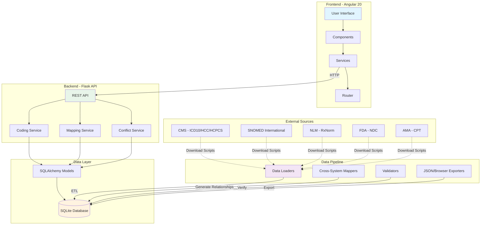

# CodeMx - Medical Coding Manager

[](https://angular.io/)
[](https://python.org/)
[](https://flask.palletsprojects.com/)
[](https://www.sqlite.org/)
[](LICENSE)

> **A comprehensive, full-stack medical coding management platform for healthcare professionals**

CodeMx is an enterprise-grade application for browsing, searching, comparing, and mapping medical coding sets including **SNOMED CT**, **ICD-10-CM**, **HCC**, **CPT**, **HCPCS**, **RxNorm**, and **NDC**. Built with Python/Flask and Angular 20, it provides powerful cross-system mapping capabilities essential for healthcare billing, risk adjustment, and clinical documentation.

---

## 🎯 Objectives

### Primary Goals
- **Unified Code Access**: Single platform to browse 7 major medical coding systems
- **Intelligent Mapping**: Automated cross-system code mappings with transitive relationships
- **Clinical Accuracy**: Validated mappings from official sources (CMS, SNOMED International, NLM)
- **Developer Friendly**: RESTful API for integration with EHR/EMR systems
- **Offline Capable**: Browser-based SQL.js mode for zero-backend deployment

### Use Cases
- **Medical Coders**: Fast code lookup with detailed descriptions and cross-references
- **Risk Adjustment**: ICD-10-CM to HCC mappings for Medicare Advantage plans
- **Clinical Documentation**: SNOMED CT to ICD-10-CM translation for EHR systems
- **Pharmacy Systems**: NDC to RxNorm to SNOMED drug mappings
- **Billing Departments**: CPT/HCPCS code validation and verification
- **Developers**: REST API for embedding coding intelligence into healthcare apps

---

## 📊 Database Statistics

| Coding System | Record Count | Description |
|---------------|--------------|-------------|
| **SNOMED CT** | ~382,000 | Clinical concepts with descriptions and semantic tags |
| **ICD-10-CM** | ~97,500 | Diagnosis codes (2026 version) |
| **HCC** | 45 | Hierarchical Condition Categories (V24/V28 models) |
| **CPT** | ~970 | Procedure codes from DHS Code List |
| **HCPCS** | ~7,800 | Level II supply/service codes |
| **RxNorm** | ~127,000 | Drug vocabulary concepts |
| **NDC** | ~150,000+ | National Drug Codes (product-level) |

### Mapping Relationships
- **SNOMED → ICD-10-CM**: ~350,000 mappings
- **ICD-10-CM → HCC**: ~18,000 mappings
- **SNOMED → HCC**: ~15,000 transitive mappings
- **RxNorm ↔ SNOMED**: ~45,000 drug mappings
- **NDC → RxNorm**: ~180,000 product mappings

**Total Database Size**: ~287 MB uncompressed | 65.65 MB compressed (gzip)

---

## 🏗️ Architecture

### System Overview



### Directory Structure

```
CodingManager/
├── backend/
│   ├── api/                          # Flask REST API
│   │   ├── app.py                    # Main Flask application
│   │   └── services/                 # Business logic services
│   │       ├── coding_service.py     # Code CRUD, search, stats
│   │       ├── mapping_service.py    # Cross-system mappings
│   │       ├── conflict_service.py   # 1:many mapping conflicts
│   │       └── icd10_chapters.py     # ICD-10 chapter metadata
│   ├── pipeline/                     # ETL Data processing pipeline
│   │   ├── models.py                 # SQLAlchemy ORM models (18 tables)
│   │   ├── pipeline.py               # Main orchestrator
│   │   ├── process_data.py           # CLI entry point
│   │   ├── loaders/                  # Data importers
│   │   │   ├── snomed_loader.py      # SNOMED CT RF2 import
│   │   │   ├── icd10_loader.py       # ICD-10-CM XML parser
│   │   │   ├── hcc_loader.py         # HCC CSV loader
│   │   │   ├── cpt_loader.py         # CPT from DHS list
│   │   │   ├── hcpcs_loader.py       # HCPCS TXT parser
│   │   │   ├── rxnorm_loader.py      # RxNorm RRF import
│   │   │   └── ndc_loader.py         # NDC TXT parser
│   │   ├── mappers/                  # Cross-system mapping generators
│   │   │   ├── icd10_hcc_mapper.py   # ICD-10 → HCC (CMS mappings)
│   │   │   ├── snomed_icd10_mapper.py# SNOMED → ICD-10 (SNOMED GPS)
│   │   │   ├── snomed_hcc_mapper.py  # SNOMED → HCC (transitive)
│   │   │   ├── rxnorm_snomed_mapper.py# RxNorm ↔ SNOMED (bidirectional)
│   │   │   └── ndc_rxnorm_mapper.py  # NDC → RxNorm (via RXNSAT)
│   │   ├── validators.py             # Data quality checks
│   │   ├── conflict_resolvers.py     # 1:many mapping disambiguation
│   │   ├── export_json.py            # Static JSON export
│   │   └── export_sqlite_browser.py  # Browser-compatible DB export
│   ├── scripts/                      # PowerShell download scripts
│   │   ├── download_all.ps1          # Orchestrator: download all codes
│   │   ├── download_icd10cm.ps1      # CMS ICD-10-CM download
│   │   ├── download_hcc.ps1          # CMS HCC mappings
│   │   ├── download_snomed.ps1       # SNOMED CT (requires UMLS license)
│   │   ├── download_cpt.ps1          # CPT codes (requires AMA license)
│   │   ├── download_hcpcs.ps1        # CMS HCPCS codes
│   │   ├── download_rxnorm.ps1       # NLM RxNorm (requires UMLS license)
│   │   └── download_ndc.ps1          # FDA NDC database
│   ├── data/
│   │   ├── staging/                  # Organized source files
│   │   ├── archive/                  # Historical versions
│   │   └── coding_manager.db         # SQLite database (287 MB)
│   └── requirements.txt              # Python dependencies
├── frontend/                         # Angular 20 SPA
│   ├── src/
│   │   ├── app/
│   │   │   ├── components/           # UI components
│   │   │   │   ├── dashboard/        # Stats & overview
│   │   │   │   ├── search/           # Universal search
│   │   │   │   ├── code-list/        # Paginated code browsing
│   │   │   │   ├── code-detail/      # Code details + mappings
│   │   │   │   ├── mapping-view/     # Dedicated mapping lookup
│   │   │   │   ├── compare/          # Side-by-side comparison
│   │   │   │   ├── conflicts/        # 1:many mapping UI
│   │   │   │   ├── resources/        # Guidelines & training
│   │   │   │   └── architecture/     # System diagram (visual)
│   │   │   ├── services/             # API client services
│   │   │   │   └── api.service.ts    # HTTP client for backend
│   │   │   ├── app.config.ts         # DI configuration
│   │   │   ├── app.routes.ts         # Route definitions
│   │   │   ├── app.ts                # Root component
│   │   │   └── app.html              # Root template
│   │   ├── environments/
│   │   │   ├── environment.ts        # Dev (Flask backend)
│   │   │   └── environment.static.ts # Prod (sql.js browser DB)
│   │   ├── styles.scss               # Global styles
│   │   └── main.ts                   # Bootstrap
│   ├── public/
│   │   └── data/
│   │       ├── coding_database.sqlite.gz  # 65.65 MB compressed DB
│   │       └── coding_database.sqlite     # 287 MB browser DB
│   ├── angular.json                  # Angular CLI config
│   ├── package.json                  # npm dependencies
│   └── tsconfig.json                 # TypeScript config
├── scripts/                          # PowerShell utility scripts
│   ├── start.ps1                     # Start backend + frontend servers
│   ├── deploy.ps1                    # Deploy to GitHub Pages
│   ├── run-pipeline.ps1              # Run data processing pipeline
│   └── generate-favicon.ps1          # Generate favicon from logo
├── docs/                             # Documentation
│   ├── DEPLOYMENT.md                 # GitHub Pages deployment guide
│   ├── TESTING_GUIDE.md              # Testing procedures
│   ├── CONFLICT_RESOLUTION.md        # 1:many mapping rules
│   ├── SQLJS_IMPLEMENTATION.md       # Browser DB architecture
│   └── STATIC_DEPLOYMENT_PLAN.md     # Static mode details
├── .github/
│   └── workflows/
│       └── deploy-pages.yml          # GitHub Actions CI/CD
└── README.md                         # This file
```

### Database Schema

#### Core Code Tables
- `snomed_codes` - SNOMED CT concepts (code, fsn, pt, semantic_tag)
- `icd10_codes` - ICD-10-CM diagnoses (code, description, chapter, category)
- `hcc_codes` - HCC categories (code, description, model_version, payment_year)
- `cpt_codes` - CPT procedures (code, description, category)
- `hcpcs_codes` - HCPCS supplies/services (code, short_desc, long_desc)
- `rxnorm_codes` - RxNorm drugs (code, name, term_type, source)
- `ndc_codes` - NDC products (code, proprietary_name, generic_name, labeler)

#### Mapping Tables (Many-to-Many)
- `snomed_icd10_mapping` - SNOMED → ICD-10-CM (map_group, priority, rule, advice)
- `icd10_hcc_mapping` - ICD-10-CM → HCC (payment_year, model_version)
- `snomed_hcc_mapping` - SNOMED → HCC (transitive via ICD-10)
- `rxnorm_snomed_mapping` - RxNorm ↔ SNOMED (bidirectional drug mappings)
- `ndc_rxnorm_mapping` - NDC → RxNorm (product to concept)
- `rxnorm_relationships` - RxNorm internal (ingredient, brand_name, dose_form)
- `snomed_cpt_mapping` - SNOMED → CPT
- `snomed_hcpcs_mapping` - SNOMED → HCPCS

#### Metadata Tables
- `conflicts` - 1:many mapping conflicts for manual review
- `conflict_resolutions` - User decisions on conflicts
- `data_sources` - Source file metadata (version, date, checksum)

### Deployment Modes

#### 1. Development Mode (Flask + Angular)
- Backend: Flask REST API on port 5000
- Frontend: Angular dev server on port 4200
- Database: SQLite file (`backend/data/coding_manager.db`)
- Hot reload: Both backend and frontend

#### 2. Static Mode (GitHub Pages)
- Frontend: Optimized Angular production build
- Backend: None (100% client-side)
- Database: sql.js (JavaScript SQLite) + IndexedDB caching
- Size: 65.65 MB compressed, ~350 MB in-browser after decompression
- Deployment: GitHub Actions → GitHub Pages

---

## 📋 Prerequisites

| Requirement | Version | Notes |
|-------------|---------|-------|
| **Python** | 3.10+ | For backend API and data pipeline |
| **pip** | Latest | Python package manager |
| **Node.js** | 18+ | For Angular frontend |
| **npm** | 9+ | Node package manager |
| **PowerShell** | 5.1+ / 7+ | For download scripts (Windows/Linux/macOS) |
| **Git** | Latest | For version control and deployment |

### Optional Requirements
- **UMLS Account** (for SNOMED CT, RxNorm downloads)
- **AMA License** (for full CPT code set)
- **SQL Browser** (for database inspection)

---

## 🚀 Quick Start

### Option 1: One-Command Launch

```powershell
# Clone repository
git clone https://github.com/swapnilprakashpatil/codemx.git
cd codemx

# Install dependencies
pip install -r backend/requirements.txt
cd frontend && npm install && cd ..

# Start servers (backend + frontend)
.\scripts\start.ps1
```

The app launches at **http://localhost:4200** (Frontend) and **http://localhost:5000** (Backend API).

### Option 2: Step-by-Step Setup

### Option 2: Step-by-Step Setup

#### 1. Install Backend Dependencies

```bash
cd backend
pip install -r requirements.txt
```

**Key packages**: Flask 3.0, SQLAlchemy 2.0, Flask-CORS

#### 2. Populate the Database

The application includes sample data. To generate the full database:

```bash
# Full pipeline (all loaders + mappers) - takes ~10-15 minutes
python -m backend.pipeline.process_data

# Or use the PowerShell wrapper for more control
.\scripts\run-pipeline.ps1                    # Run everything
.\scripts\run-pipeline.ps1 -Mode LoadersOnly  # Only load codes
.\scripts\run-pipeline.ps1 -Only snomed,icd10 # Specific systems
```

**What gets loaded:**
- ✅ 382,000 SNOMED CT concepts with descriptions
- ✅ 97,500 ICD-10-CM diagnosis codes (2026)
- ✅ 45 HCC risk adjustment categories (V24/V28)
- ✅ 970 CPT procedure codes (DHS Code List)
- ✅ 7,800 HCPCS Level II codes
- ✅ 127,000 RxNorm drug concepts
- ✅ 150,000+ NDC product codes
- ✅ Cross-system mappings (~600,000+ relationships)

#### 3. Start the Backend API

```bash
# From project root
python -m backend.api.app

# Or with the start script
.\scripts\start.ps1 -NoBrowser  # Launch without opening browser
```

Flask API starts on **http://localhost:5000**

#### 4. Install Frontend Dependencies

```bash
cd frontend
npm install
```

**Key packages**: Angular 20, RxJS 7, sql.js, pako (gzip)

#### 5. Start the Frontend Dev Server

```bash
cd frontend
npx ng serve

# Or specify port
npx ng serve --port 4200
```

Angular app starts on **http://localhost:4200**

### Alternative: Static Mode (No Backend Required)

For deployment or offline use:

```bash
# Build for static mode with sql.js
cd frontend
npm run build -- --configuration=static

# Serve locally
npx http-server dist/frontend -p 8080
```

Access at **http://localhost:8080** - Database runs entirely in browser!

---

## ✨ Features

### Core Capabilities

#### 🔍 Universal Search
- **Full-text search** across all 7 coding systems simultaneously
- **Filter by code type** (SNOMED, ICD-10, HCC, CPT, HCPCS, RxNorm, NDC)
- **Autocomplete** with code + description preview
- **Search history** with browser localStorage
- **Intelligent ranking** (exact code match → starts-with → contains)

#### 📖 Code Browsers
- **Paginated lists** with configurable page size (10/25/50/100)
- **Server-side pagination** for large datasets
- **Chapter/category grouping** (ICD-10-CM chapters, HCC categories)
- **Hierarchical display** for ICD-10-CM subcodes
- **Quick filters** by code prefix or category

#### 🔬 Code Details
Each code shows:
- **Full description** (FSN, PT, synonyms)
- **Metadata** (status, effective dates, source version)
- **All cross-system mappings** with relationship types
- **Mapping rules** where applicable (SNOMED → ICD-10 rules/advice)
- **Related codes** within the same system
- **Transitive mappings** (SNOMED → ICD-10 → HCC chain)

#### 🔗 Intelligent Mapping Lookup
- **SNOMED → ICD-10-CM**: With map group, priority, rules, and advice
- **ICD-10-CM → HCC**: CMS risk adjustment mappings (V24/V28)
- **SNOMED → HCC**: Transitive mappings via ICD-10-CM
- **RxNorm ↔ SNOMED**: Bidirectional drug concept mappings
- **NDC → RxNorm**: Product-level to concept-level drug mappings
- **Mapping Graph Visualization**: Interactive network diagram of relationships

#### 🆚 Side-by-Side Comparison
- Compare up to 10 codes simultaneously
- **Cross-system comparison** (compare ICD-10 vs SNOMED vs HCC)
- **Unified attribute view** with differences highlighted
- **Mapping overlap detection** (find common mapping targets)
- **Export comparison** to CSV/JSON

#### 📊 Dashboard & Statistics
Real-time stats:
- Total codes per system
- Total mapping relationships
- Database size and last update date
- Most frequently searched codes
- Recent mapping conflicts

#### 🎯 Conflict Resolution
For 1:many mappings:
- **Visual conflict browser** with resolution UI
- **Bulk actions** for similar patterns
- **Context-based suggestions** using mapping rules
- **Audit trail** of resolution decisions
- **Export unresolved conflicts** for review

#### 📚 Resources & Guidelines
- **Coding guidelines** links (CMS, AMA, AHIMA)
- **Training materials** (Medicare Learning Network, AAPC)
- **Code update notifications** (ICD-10-CM annual updates, HCC model changes)
- **Quick reference cards** for each coding system

### Advanced Features

#### 🌐 RESTful API
Full API access for programmatic integration:
- **JSON responses** for all endpoints
- **Pagination support** with `page` and `per_page` parameters
- **CORS enabled** for cross-origin requests
- **Error handling** with standard HTTP status codes
- **Rate limiting** (configurable)

#### 💾 Offline Mode
- **IndexedDB caching** of database in browser
- **Service Worker** for offline functionality (future)
- **Progressive Web App** capabilities (future)
- **Local storage** for user preferences

#### 🎨 Modern UI/UX
- **Responsive design** (mobile, tablet, desktop)
- **Dark mode** support (future)
- **Keyboard shortcuts** for power users
- **Accessibility** (WCAG 2.1 AA compliant - in progress)
- **Print-friendly** layouts for reference cards

#### 🔒 Security Features
- **No PHI/PII storage** (codes only, no patient data)
- **SQL injection protection** (parameterized queries)
- **XSS prevention** (Angular sanitization)
- **HTTPS only** in production
- **Content Security Policy** headers

---

## 🔌 API Reference

Base URL: `http://localhost:5000/api`

### Health & Statistics

| Endpoint | Method | Description | Response |
|----------|--------|-------------|----------|
| `/api/health` | GET | Health check | `{ "status": "healthy" }` |
| `/api/stats` | GET | Database statistics | Counts for all code systems + mappings |

### Code Listing (Paginated)

| Endpoint | Method | Parameters | Description |
|----------|--------|------------|-------------|
| `/api/snomed` | GET | `page`, `per_page`, `search` | List SNOMED CT codes |
| `/api/icd10` | GET | `page`, `per_page`, `search` | List ICD-10-CM codes |
| `/api/hcc` | GET | `page`, `per_page` | List HCC codes |
| `/api/cpt` | GET | `page`, `per_page`, `search` | List CPT codes |
| `/api/hcpcs` | GET | `page`, `per_page`, `search` | List HCPCS codes |
| `/api/rxnorm` | GET | `page`, `per_page`, `search` | List RxNorm concepts |
| `/api/ndc` | GET | `page`, `per_page`, `search` | List NDC products |

**Example:**
```bash
GET /api/snomed?page=1&per_page=25&search=diabetes
```

**Response:**
```json
{
  "items": [
    {
      "code": "73211009",
      "fsn": "Diabetes mellitus (disorder)",
      "pt": "Diabetes mellitus",
      "semantic_tag": "disorder"
    }
  ],
  "total": 1247,
  "page": 1,
  "per_page": 25,
  "pages": 50
}
```

### Code Details

| Endpoint | Method | Description |
|----------|--------|-------------|
| `/api/snomed/<code>` | GET | SNOMED code detail with all mappings |
| `/api/icd10/<code>` | GET | ICD-10-CM code detail with mappings |
| `/api/hcc/<code>` | GET | HCC code detail |
| `/api/cpt/<code>` | GET | CPT code detail |
| `/api/hcpcs/<code>` | GET | HCPCS code detail |
| `/api/rxnorm/<code>` | GET | RxNorm concept detail |
| `/api/ndc/<code>` | GET | NDC product detail |

**Example:**
```bash
GET /api/snomed/73211009
```

**Response:**
```json
{
  "code": "73211009",
  "fsn": "Diabetes mellitus (disorder)",
  "pt": "Diabetes mellitus",
  "semantic_tag": "disorder",
  "icd10_mappings": [
    {
      "code": "E11.9",
      "description": "Type 2 diabetes mellitus without complications",
      "map_group": 1,
      "map_priority": 1,
      "map_rule": "ALWAYS E11.9",
      "map_advice": "MAPPED FOLLOWING WHO GUIDANCE"
    }
  ],
  "hcc_mappings": [
    {
      "code": "19",
      "description": "Diabetes without Complication",
      "via_icd10_code": "E11.9"
    }
  ]
}
```

### Cross-System Mappings

| Endpoint | Method | Description |
|----------|--------|-------------|
| `/api/mappings/snomed-to-icd10/<code>` | GET | SNOMED → ICD-10-CM mappings |
| `/api/mappings/snomed-to-hcc/<code>` | GET | SNOMED → HCC mappings (transitive) |
| `/api/mappings/icd10-to-hcc/<code>` | GET | ICD-10-CM → HCC mappings |
| `/api/mappings/rxnorm-to-snomed/<code>` | GET | RxNorm → SNOMED drug mappings |
| `/api/mappings/ndc-to-rxnorm/<code>` | GET | NDC → RxNorm mappings |
| `/api/mappings/rxnorm-to-ndc/<code>` | GET | RxNorm → NDC mappings |

### Search & Compare

| Endpoint | Method | Parameters | Description |
|----------|--------|------------|-------------|
| `/api/search` | GET | `q` (query), `code_type` (optional) | Universal search |
| `/api/autocomplete` | GET | `q` (query), `code_type`, `limit` | Autocomplete suggestions |
| `/api/compare` | GET | `codes` (comma-separated) | Compare multiple codes |

**Example:**
```bash
GET /api/compare?codes=73211009,E11.9,19
```

### Conflicts

| Endpoint | Method | Description |
|----------|--------|-------------|
| `/api/conflicts` | GET | List all mapping conflicts |
| `/api/conflicts/stats` | GET | Conflict statistics by system |
| `/api/conflicts/<id>` | GET | Get specific conflict |
| `/api/conflicts/<id>` | PATCH | Resolve conflict |
| `/api/conflicts/bulk` | PATCH | Bulk resolve conflicts |

### Resources

| Endpoint | Method | Description |
|----------|--------|-------------|
| `/api/resources` | GET | Coding guidelines, training materials, updates |

---

## 📥 Download Scripts

To populate the database with full production coding sets:

```powershell
# Download all coding sets (requires licenses for SNOMED/CPT)
.\backend\scripts\download_all.ps1

# Or download individually
.\backend\scripts\download_icd10cm.ps1   # CMS ICD-10-CM (public domain)
.\backend\scripts\download_hcc.ps1       # CMS HCC mappings (public domain)
.\backend\scripts\download_hcpcs.ps1     # CMS HCPCS codes (public domain)
.\backend\scripts\download_ndc.ps1       # FDA NDC database (public domain)
.\backend\scripts\download_snomed.ps1    # SNOMED CT (requires UMLS license)
.\backend\scripts\download_cpt.ps1       # CPT codes (requires AMA license)
.\backend\scripts\download_rxnorm.ps1    # RxNorm (requires UMLS license)
```

### Licensing Requirements

| Coding System | License Required | Source |
|---------------|------------------|--------|
| **ICD-10-CM** | ❌ Public Domain | [CMS](https://www.cms.gov/medicare/coding-billing/icd-10-codes) |
| **HCC** | ❌ Public Domain | [CMS](https://www.cms.gov/medicare/health-plans/medicareadvtgspecratestats/risk-adjustors) |
| **HCPCS** | ❌ Public Domain | [CMS](https://www.cms.gov/medicare/coding-billing/healthcare-common-procedure-system) |
| **NDC** | ❌ Public Domain | [FDA](https://www.fda.gov/drugs/drug-approvals-and-databases/national-drug-code-directory) |
| **SNOMED CT** | ✅ UMLS License | [NLM UMLS](https://www.nlm.nih.gov/research/umls/index.html) |
| **RxNorm** | ✅ UMLS License | [NLM RxNorm](https://www.nlm.nih.gov/research/umls/rxnorm/index.html) |
| **CPT** | ✅ AMA License | [AMA](https://www.ama-assn.org/practice-management/cpt) |

> **Note**: The application ships with sample data for development. For production use with full datasets, obtain appropriate licenses.

---

## 🛠️ Tech Stack

### Backend
| Technology | Version | Purpose |
|------------|---------|---------|
| **Python** | 3.10+ | Core language |
| **Flask** | 3.0 | REST API framework |
| **SQLAlchemy** | 2.0 | ORM and database toolkit |
| **SQLite** | 3.45+ | Embedded database |
| **Flask-CORS** | 4.0 | Cross-origin resource sharing |
| **lxml** | 5.0+ | XML parsing (ICD-10-CM) |
| **pandas** | 2.0+ | Data manipulation (optional) |

### Frontend
| Technology | Version | Purpose |
|------------|---------|---------|
| **Angular** | 20 | SPA framework |
| **TypeScript** | 5.3+ | Type-safe JavaScript |
| **RxJS** | 7.8+ | Reactive programming |
| **sql.js** | 1.10+ | Browser-based SQLite |
| **pako** | 2.1+ | Gzip compression/decompression |
| **SCSS** | N/A | Styling |

### DevOps & Tools
| Tool | Purpose |
|------|---------|
| **PowerShell** | Download scripts, automation |
| **GitHub Actions** | CI/CD pipeline |
| **npm** | Frontend package management |
| **pip** | Backend package management |
| **Angular CLI** | Frontend build tooling |

### Data Sources
- **SNOMED International**: RF2 format (Concept, Description, Relationship files)
- **CMS**: ICD-10-CM XML, HCC CSV mappings, HCPCS TXT files
- **NLM**: RxNorm RRF files
- **FDA**: NDC database TXT format
- **AMA/DHS**: CPT codes from DHS Code List

---

## 🚀 Deployment

### GitHub Pages (Recommended)

Deploy as a static site with browser-based database:

```bash
# 1. Ensure database is exported and compressed
python -m backend.pipeline.export_sqlite_browser --compress

# 2. Commit and push
git add .
git commit -m "Deploy to GitHub Pages"
git push origin main

# Or use the deploy script
.\scripts\deploy.ps1 -Message "Update deployment"
```

GitHub Actions automatically:
1. Builds Angular app in static mode
2. Verifies compressed database exists
3. Deploys to GitHub Pages

**Live URL**: https://swapnilprakashpatil.github.io/codemx/

### Alternative Platforms

#### Vercel
```bash
cd frontend
vercel --prod
```

#### Netlify
```bash
# Build settings
Build command: npm run build -- --configuration=static
Publish directory: dist/frontend
```

#### Azure Static Web Apps
```bash
# Connected via GitHub integration
App location: /frontend
Output location: dist/frontend
```

### Self-Hosted

#### Docker (Future)
```bash
docker-compose up -d
```

#### Traditional Hosting
1. Build frontend: `npm run build -- --configuration=static`
2. Serve `dist/frontend` with nginx/Apache
3. Ensure database file is accessible at `/data/coding_database.sqlite.gz`

---

## 📚 References & Resources

### Official Documentation
- [ICD-10-CM Official Guidelines](https://www.cms.gov/medicare/coding-billing/icd-10-codes/icd-10-cm-official-guidelines-coding-and-reporting) - CMS coding guidelines
- [SNOMED CT Browser](https://browser.ihtsdotools.org/) - Official SNOMED CT terminology browser
- [CMS HCC Risk Adjustment Model](https://www.cms.gov/medicare/health-plans/medicareadvtgspecratestats/risk-adjustors) - Medicare Advantage risk adjustment
- [RxNorm Documentation](https://www.nlm.nih.gov/research/umls/rxnorm/docs/index.html) - NLM RxNorm technical documentation
- [NDC Database](https://www.fda.gov/drugs/drug-approvals-and-databases/national-drug-code-directory) - FDA National Drug Code directory
- [CPT Code Information](https://www.ama-assn.org/practice-management/cpt) - American Medical Association CPT resources

### Training & Certification
- [CMS Medicare Learning Network](https://www.cms.gov/outreach-and-education/medicare-learning-network-mln/mlngeninfo) - Free educational materials
- [AHIMA](https://www.ahima.org/) - American Health Information Management Association
- [AAPC](https://www.aapc.com/) - American Academy of Professional Coders
- [CCS (Certified Coding Specialist)](https://www.ahima.org/certification/ccs/) - AHIMA professional certification
- [CPC (Certified Professional Coder)](https://www.aapc.com/certification/cpc/) - AAPC professional certification

### Standards Organizations
- [SNOMED International](https://www.snomed.org/) - SNOMED CT terminology standards
- [WHO](https://www.who.int/standards/classifications/classification-of-diseases) - ICD-10 classification standards
- [HL7](https://www.hl7.org/) - Healthcare interoperability standards
- [FHIR](https://www.hl7.org/fhir/) - Fast Healthcare Interoperability Resources

### Academic Papers
- *SNOMED CT to ICD-10 Mapping Guidelines* - SNOMED International
- *CMS-HCC Risk Adjustment Model* - CMS technical documentation
- *RxNorm: A Standardized Nomenclature for Clinical Drugs* - NLM research paper

### Related Projects
- [UMLS Metathesaurus](https://www.nlm.nih.gov/research/umls/knowledge_sources/metathesaurus/index.html) - Unified Medical Language System
- [FHIR Terminology Service](https://www.hl7.org/fhir/terminology-service.html) - HL7 FHIR terminology server specification
- [OpenMRS](https://openmrs.org/) - Open-source medical record system

---

## 🤝 Contributing

We welcome contributions! Please follow these guidelines:

### Development Workflow
1. Fork the repository
2. Create a feature branch: `git checkout -b feature/your-feature-name`
3. Make your changes with clear commit messages
4. Add tests for new features
5. Run existing tests: `pytest` (backend) and `npm test` (frontend)
6. Submit a pull request

### Code Standards
- **Python**: Follow PEP 8, use type hints
- **TypeScript**: Follow Angular style guide
- **Documentation**: Update README for new features
- **Testing**: Maintain >80% code coverage

### Areas for Contribution
- 🐛 **Bug fixes**: Check [Issues](https://github.com/swapnilprakashpatil/codemx/issues)
- ✨ **New features**: Propose in [Discussions](https://github.com/swapnilprakashpatil/codemx/discussions)
- 📝 **Documentation**: Improve guides and API docs
- 🧪 **Testing**: Add unit/integration tests
- 🌍 **Internationalization**: Add support for non-English coding systems (ICD-10-WHO)

---

## 📜 License

This project is licensed under the **MIT License** - see the [LICENSE](LICENSE) file for details.

### Third-Party Licenses
- **SNOMED CT**: Subject to [SNOMED International license](https://www.snomed.org/snomed-ct/get-snomed)
- **CPT**: Copyright American Medical Association (AMA)
- **ICD-10-CM, HCC, HCPCS, NDC**: Public domain (U.S. Government works)
- **RxNorm**: Public domain via NLM

---

## 📞 Support

- **Issues**: [GitHub Issues](https://github.com/swapnilprakashpatil/codemx/issues)
- **Discussions**: [GitHub Discussions](https://github.com/swapnilprakashpatil/codemx/discussions)
- **Email**: swapnilprakashpatil@example.com (update with actual contact)

---

## 🏆 Acknowledgments

- **CMS** - For publicly available ICD-10-CM, HCC, and HCPCS data
- **SNOMED International** - For SNOMED CT terminology
- **NLM** - For RxNorm and UMLS resources
- **FDA** - For NDC database
- **Open source community** - For Angular, Flask, SQLAlchemy, and other tools

---

## 🗺️ Roadmap

### Version 2.0 (Q2 2026)
- [ ] ICD-11 support (WHO 2022 version)
- [ ] LOINC laboratory codes integration
- [ ] Advanced analytics dashboard
- [ ] Export to CSV/Excel
- [ ] API rate limiting & authentication
- [ ] Dark mode theme

### Version 3.0 (Q4 2026)
- [ ] Multi-language support (Spanish, French)
- [ ] Machine learning for mapping predictions
- [ ] Integration with FHIR terminology service
- [ ] Mobile apps (iOS/Android)
- [ ] Collaborative features (team accounts)
- [ ] Audit logging

---

**Built with ❤️ for healthcare professionals**

**Repository**: https://github.com/swapnilprakashpatil/codemx  
**Live Demo**: https://swapnilprakashpatil.github.io/codemx/

---
